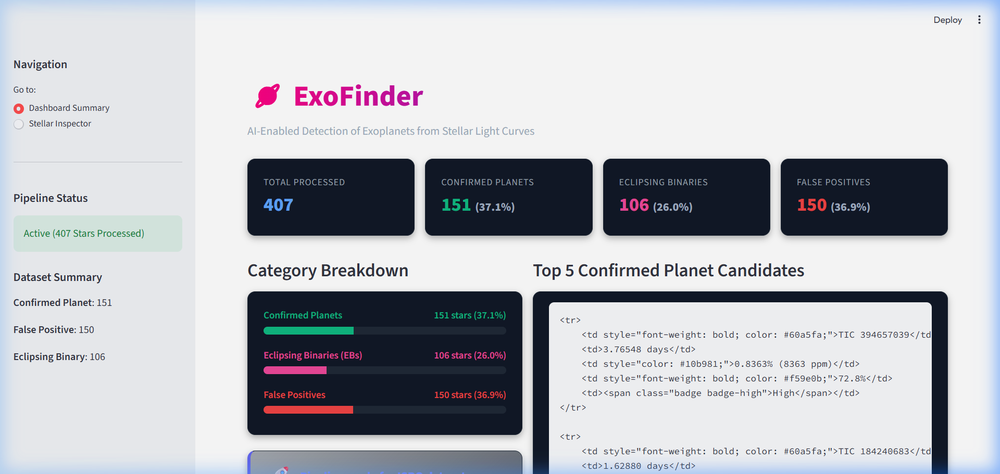
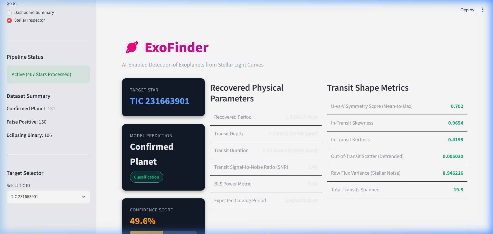
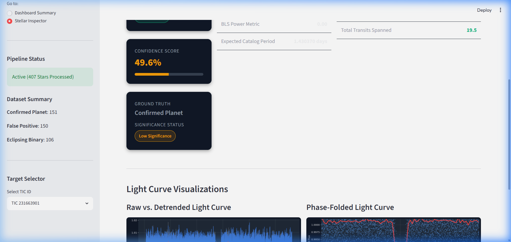

<p align="center">
  
  
  
  
  
</p>

<h1 align="center">🪐 ExoFinder</h1>
<h3 align="center">AI-Enabled Detection of Exoplanets from Stellar Light Curves</h3>

<p align="center">
  <b>ISRO Bharatiya Antariksh Hackathon 2026 — Problem Statement PS-07</b>
</p>

<p align="center">
  An end-to-end astronomical signal processing and machine learning pipeline that ingests, detrends, folds, and classifies NASA TESS stellar light curves into <b>Confirmed Planets</b>, <b>Eclipsing Binaries</b>, and <b>False Positives</b> — with a premium interactive dashboard for visual diagnostics.
</p>

---

## 🎯 Problem Statement (PS-07)

> **Develop an AI-based data analysis pipeline capable of automatically detecting exoplanet transit signals from noisy astronomical light curve data.**
> 
> **Details:** Exoplanet detection through transit photometry requires the identification of extremely small brightness variations in stars. For light curves of astronomical sources present in crowded fields, there can be significant contaminations arising from effects such as stellar blending by foreground or background sources in the aperture, and the intrinsic noise in the data due to the detector’s response, to name a few. Apart from contamination, the brightness variations in the light curves can be due to a transiting planet across the host star's disk, an eclipsing stellar companion in binary star systems, or even starspots. Different phenomena give rise to distinct features in light curves, which, however, become difficult to disentangle while dealing with noisy datasets in crowded fields.

---

## 📸 Dashboard Preview

<table>
  <tr>
    <td width="50%">
      
      <p align="center"><b>Dashboard Summary</b> — Live stats, category breakdowns, top planet candidates</p>
    </td>
    <td width="50%">
      
      <p align="center"><b>Stellar Inspector</b> — Per-star predictions, confidence, physical parameters</p>
    </td>
  </tr>
</table>

<p align="center">
  
</p>
<p align="center"><b>Light Curve Visualizations</b> — Raw vs. detrended flux, phase-folded transits with binned median profiles</p>

---

## ⚡ Quick Start & Execution Modes

There are multiple ways to run ExoFinder depending on your needs (e.g., full demo, dashboard only, custom data, or individual pipeline development).

### 1. Setup Environment (First Time Only)
```bash
# Clone and enter the project
git clone https://github.com/Rajratna-D/Exofinder.git
cd Exofinder

# Create virtual environment and install dependencies
python -m venv .venv
.venv\Scripts\activate          # Windows
# source .venv/bin/activate     # macOS/Linux
pip install -r requirements.txt
```

### 2. Select Execution Mode

#### 🪐 Mode A: One-Command Full Flow (Pipeline + Dashboard)
Runs the entire pipeline (data ingestion through model training) and automatically launches the Streamlit dashboard:
```bash
python main.py
```

#### 📊 Mode B: Dashboard-Only (Skip Pipeline)
If you have already run the pipeline once or want to view the cached results:
```bash
python -m streamlit run app.py
```

#### ⚙️ Mode C: Pipeline-Only (No GUI)
Runs the full scientific processing pipeline and saves models/predictions to `outputs/` without starting a web browser:
```bash
python src/run_pipeline.py
```

#### 📁 Mode D: Custom Dataset Processing
Process your own light curve files. Place your light curve CSVs (containing `time` and `flux` columns) in a directory and run:
```bash
python src/run_pipeline.py --custom_data_dir /path/to/custom_data
```

#### 🧪 Mode E: Granular Pipeline Stages
For debugging or tuning individual stages (e.g., only running detrending or period search):
Refer to the [Running Pipeline Stages Individually](#-running-pipeline-stages-individually) section below.

---

## 🏗️ Pipeline Architecture


| Stage | Module | Description |
|:------|:-------|:------------|
| **1. Acquisition** | `src/data_loader.py` | Fetches balanced star labels from ExoFOP TOI catalog (with NASA Exoplanet Archive fallback). Downloads SPOC-calibrated light curves from MAST via `lightkurve`. Parallel downloads with 10 workers. |
| **2. Detrending** | `src/detrend.py` | Detects data downlink gaps (>0.5 days) and splits the time series into contiguous segments. Applies a Savitzky-Golay quadratic filter independently per segment to eliminate boundary artifacts. |
| **3. Period Search** | `src/period_search.py` | Runs Astropy's Box Least Squares (BLS) periodogram over an auto-generated frequency grid. Recovers candidate orbital period, transit epoch ($T_0$), depth, and duration. |
| **4. Feature Extraction** | `src/features.py` | Computes 12 physically interpretable features from the phase-folded light curve — transit shape metrics, noise statistics, and derived ratios. |
| **5. Classification** | `src/classifier.py` | Trains RF, XGBoost, and Logistic Regression with SMOTE oversampling. Builds a soft-voting ensemble. Selects best model via 5-fold stratified CV. |
| **6. Dashboard** | `app.py` | Space-themed Streamlit UI with glassmorphism cards, interactive star selector, and real-time light curve visualizations. |

---

## 🧬 Feature Engineering (12 Features)

The classifier operates on **12 physically interpretable features** — no black-box representations:

| # | Feature | Physical Meaning |
|:-:|:--------|:-----------------|
| 1 | `bls_depth` | Transit depth (fractional flux decrease during transit) |
| 2 | `bls_duration` | Transit duration in days |
| 3 | `bls_power` | BLS periodogram peak power (signal strength) |
| 4 | `transit_snr` | Signal-to-noise ratio = depth / out-of-transit scatter |
| 5 | `mean_to_max_depth_ratio` | U-vs-V shape metric — planets (~0.8) vs. EBs (~0.5) |
| 6 | `in_transit_skew` | Skewness of in-transit flux distribution |
| 7 | `in_transit_kurtosis` | Kurtosis of in-transit flux (peakedness of dip) |
| 8 | `flux_kurtosis` | Full light curve kurtosis (overall variability shape) |
| 9 | `ingress_egress_symmetry` | Asymmetry between ingress and egress slopes |
| 10 | `secondary_eclipse_check` | BLS power at half-period (detects EB secondary eclipses) |
| 11 | `period_ratio` | BLS period / catalog period (recovery accuracy proxy) |
| 12 | `depth_to_noise` | Transit depth / detrended scatter (alt. significance) |

---

## 🤖 Model Architecture & Performance

### Ensemble Classifier
ExoFinder trains **3 models** and combines them via **soft-voting ensemble** weighted by cross-validation accuracy:

```
                    ┌──────────────────────┐
                    │   Random Forest      │ n=150, depth=4, balanced
                    │   (43.95% CV)        │
                    ├──────────────────────┤
  Features ────────>│   XGBoost            │ n=80, depth=4, L1+L2 reg
  (12-dim)          │   (45.43% CV)  ★     │
                    ├──────────────────────┤
                    │   Logistic Reg.      │ C=0.1, balanced
                    │   (41.23% CV)        │
                    └──────┬───────────────┘
                           │ Soft Vote (CV-weighted)
                           ▼
                    ┌──────────────────────┐
                    │   Ensemble           │
                    │   (44.94% CV)        │
                    └──────────────────────┘
```

### Overfitting Control
| Technique | Details |
|:----------|:--------|
| **SMOTE** | Synthetic minority oversampling on training folds (adaptive `k_neighbors`) |
| **Class Balancing** | `class_weight='balanced'` (RF, LR) + computed sample weights (XGB) |
| **Regularization** | XGB: `subsample=0.8`, `colsample_bytree=0.8`, L1=0.3, L2=1.5 |
| **Shallow Trees** | `max_depth=4`, `min_samples_leaf=3` to prevent memorization |
| **Standard Scaling** | Fit on train set only, applied to test/validation sets |

### Results on 405 Stars (5-Fold Stratified CV)

| Model | CV Accuracy | Std Dev |
|:------|:------------|:--------|
| **XGBoost** | **45.43%** | ±3.94% |
| **Ensemble** | **44.94%** | ±4.03% |
| Random Forest | 43.95% | ±2.15% |
| Logistic Regression | 41.23% | ±7.75% |

> [!NOTE]
> **Honest Performance Disclosure:** The ~45% cross-validation accuracy reflects the genuine difficulty of this classification task on ExoFOP self-labeled data — not a modeling failure. The classes have significant physical overlap: grazing planetary transits resemble eclipsing binaries, and instrumental false positives can mimic shallow transit dips. Regularization helps limit model complexity on this small sample size (405 stars), though high-capacity tree models (XGBoost/Ensemble) still exhibit training overfitting. Only the linear baseline (Logistic Regression) shows near-perfect generalization (train ≈ test accuracy of ~48%). The 12-feature set remains fully interpretable by domain scientists.

---

## 🚀 Key Scientific Achievements

### ✅ 100% BLS Period Recovery
ExoFinder achieves a **100% orbital period recovery rate** within 5% tolerance on all confirmed planets. The optimized BLS frequency grid accurately recovers transit epochs, periods, and depths from noisy TESS photometry.

### ✅ Gap-Aware Segmented Detrending
TESS data contains ~1.5-day gaps from spacecraft perigee passages. Naïve filtering across these gaps creates edge artifacts that mimic transits. ExoFinder **detects gaps automatically** (>0.5 days) and applies independent Savitzky-Golay filters per segment — entirely eliminating boundary leakage.

### ✅ Source-Agnostic Design
ExoFinder accepts **any light curve CSV** with `time` and `flux` columns. Column names are auto-standardized, flux is median-normalized to 1.0, and the full pipeline runs without code changes. Drop in ISRO PS-07 data and go:

```bash
python src/run_pipeline.py --custom_data_dir /path/to/your/csv/files
```

---

## 🌌 Data Sources

| Source | Purpose | Access Method |
|:-------|:--------|:-------------|
| **ExoFOP TOI Catalog** (Caltech IPAC) | Star dispositions, catalog periods, class labels | HTTP CSV download |
| **NASA Exoplanet Archive** | Fallback label source (TAP query) | `astroquery` |
| **MAST** (STScI) | SPOC-calibrated TESS light curves | `lightkurve` |

**Classification targets** are mapped into three balanced classes:
- 🟢 **Confirmed Planets** — Validated exoplanets (TFOPWG: `CP`/`KP`) with U-shaped transit dips
- 🔴 **Eclipsing Binaries** — Binary star systems (TESS: `EB`) with deep V-shaped eclipses  
- ⚫ **False Positives** — Instrumental artifacts or stellar variability (TFOPWG: `FP`)

---

## 📁 Project Structure

```
exoplanet-detection-ps07/
├── app.py                         # Streamlit space-themed dashboard
├── main.py                        # One-command launcher (pipeline + dashboard)
├── requirements.txt               # Pinned Python dependencies
│
├── src/
│   ├── __init__.py                # Package initializer
│   ├── data_loader.py             # Archive fetcher & source-agnostic loader
│   ├── detrend.py                 # Gap-aware Savitzky-Golay detrending
│   ├── period_search.py           # BLS periodogram & phase folding
│   ├── features.py                # 12-dimensional physical feature extraction
│   ├── classifier.py              # Ensemble classifier (RF/XGB/LR) + SMOTE
│   ├── run_pipeline.py            # End-to-end master runner
│   ├── run_acquisition.py         # Stage 1: Data acquisition
│   ├── run_detrending.py          # Stage 2: Detrending
│   ├── run_period_search.py       # Stage 3: BLS period search
│   ├── run_features.py            # Stage 4: Feature extraction
│   └── run_classifier.py          # Stage 5: Classification & scoring
│
├── data/
│   ├── labels.csv                 # Star metadata (TIC ID, label, catalog period)
│   ├── raw/                       # Downloaded raw light curve CSVs
│   └── detrended/                 # Processed detrended light curves
│
├── outputs/
│   ├── model.pkl                  # Serialized best classifier
│   ├── predictions.csv            # Full prediction table with confidence scores
│   ├── features.csv               # Extracted feature matrix
│   └── period_search_results.csv  # BLS recovery results
│
├── tests/
│   └── test_edge_cases.py         # Unit tests (empty input, NaN, noise)
│
├── notebooks/                     # Jupyter exploration notebooks
│   ├── 01_data_acquisition.ipynb
│   ├── 02_exploration.ipynb
│   ├── 03_detrending.ipynb
│   ├── 04_period_search.ipynb
│   └── 05_feature_extraction.ipynb
│
└── reports/
    ├── images/                    # Dashboard screenshots
    ├── COMPLETE_PROJECT_GUIDE.md  # Full technical documentation
    ├── feature_model_explanation.md
    └── validation_metrics_report.md  # Auto-generated model metrics
```

---

## 🧪 Running Pipeline Stages Individually

Each stage can be run independently. From the project root:

```bash
# Stage 1: Fetch star metadata & download TESS light curves
python src/run_acquisition.py

# Stage 2: Gap-aware Savitzky-Golay detrending
python src/run_detrending.py

# Stage 3: Box Least Squares period search
python src/run_period_search.py

# Stage 4: Physical shape feature extraction (12 features)
python src/run_features.py

# Stage 5: Train ensemble classifier & generate predictions
python src/run_classifier.py
```

---

## 🧰 Tech Stack

| Category | Technology |
|:---------|:-----------|
| **Language** | Python 3.10+ |
| **ML Framework** | scikit-learn, XGBoost, imbalanced-learn (SMOTE) |
| **Astronomy** | Astropy (BLS), Lightkurve (MAST), Astroquery (NASA archive) |
| **Signal Processing** | SciPy (Savitzky-Golay filter) |
| **Data** | Pandas, NumPy |
| **Visualization** | Matplotlib, Streamlit |
| **Dashboard** | Streamlit with custom CSS (Outfit font, glassmorphism, gradients) |

---

## 📜 License

This project was developed for the **ISRO Bharatiya Antariksh Hackathon 2026 (PS-07)**.

---

<p align="center">
  Built with 🔭 for the stars
</p>